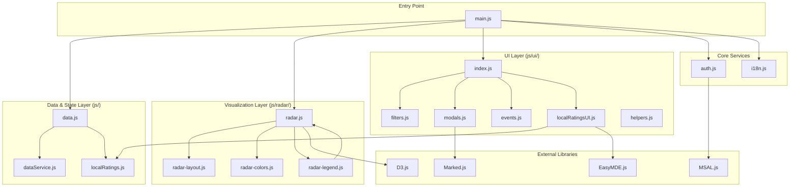

# Application Architecture

This document describes the high-level architecture and structure of the **Conclusion Tech Radar** application.

## Overview

The Conclusion Tech Radar is a client-side web application designed to visualize technology trends and maturity across various companies within the Conclusion ecosystem. It allows users to explore technologies through an interactive radar, filter by different dimensions, and manage personal ratings stored locally.

## Core Architectural Patterns

- **Modular Module System**: The application is built using ES6 modules, promoting encapsulation and clear separation of concerns.
- **State-Driven Rendering**: The UI is a reflection of the application's internal state. Changes to filters or data trigger a re-processing of the data, which then updates the visualization and UI components.
- **Unidirectional Data Flow (mostly)**: UI events update filters -> Filters update processed data -> Processed data updates the Radar and Legends.

---

## Component Diagram

The following diagram illustrates the different areas of the application and their dependencies:

---

## Area Explanations

### 1. Entry Point (`main.js`)
The `main.js` file is the orchestrator of the application. It:
- Initializes the internationalization (`i18n`).
- Triggers the initial data load.
- Sets up the Radar visualization and UI modules.
- Manages the authentication lifecycle (sign-in, sign-out, and session checking).

### 2. Data & State Layer
This layer is responsible for how data is fetched, merged, and filtered.
- **`data.js`**: The central hub for state. It maintains the `rawData` (all technologies and ratings) and `activeFilters`. It provides the `processData()` logic that computes which "blips" should be visible on the radar based on current filters.
- **`localRatings.js`**: Specifically manages interactions with the browser's `localStorage` for user-defined ratings and custom technologies.
- **`dataService.js`**: Handles API requests to fetch live data from external sources after authentication.

### 3. Visualization Layer (`js/radar/`)
This layer handles the complex D3.js logic for rendering the Tech Radar.
- **`radar.js`**: The main entry point for the visualization. It draws the rings and segments.
- **`radar-layout.js`**: Contains algorithms for distributing blips within their respective rings to minimize overlap.
- **`radar-colors.js`**: Defines the color palette for different categories and phases.
- **`radar-legend.js`**: Manages the list of technologies shown next to the radar and handles highlighting/interaction between the legend and the blips.

### 4. UI Layer (`js/ui/`)
A modularized collection of components that handle user interaction.
- **`filters.js`**: Renders the sidebar with company, category, phase, and tag filters.
- **`modals.js`**: Manages the logic for showing detailed information in popup windows (e.g., technology details, company descriptions).
- **`localRatingsUI.js`**: Controls the "Manage Ratings" tab, including the form for adding/editing local ratings and the rich-text editor integration.
- **`events.js`**: Centralizes global event listeners and coordinates updates between the UI and the data layer.

### 5. Shared Services
- **`auth.js`**: Interfaces with the Microsoft Authentication Library (MSAL) to provide secure login/logout capabilities.
- **`i18n.js`**: Provides translation services, allowing the UI to switch between English (EN) and Dutch (NL).

---

## Data Flow Example: Applying a Filter

1.  **Interaction**: User clicks a company tag in the sidebar.
2.  **Event**: `ui/filters.js` triggers a call to `data.js`'s `setFilter('company', 'CompanyName', true)`.
3.  **State Update**: `data.js` updates its `activeFilters` set and runs `processData()` to get a new list of blips.
4.  **Re-render**: `main.js` or `ui/events.js` calls `updateRadar(newData)`, which causes `radar.js` to transition the blips to their new states (enter, update, or exit).

## Dependencies

- **[D3.js](https://d3js.org/)**: Used for SVG-based data visualization.
- **[MSAL.js](https://github.com/AzureAD/microsoft-authentication-library-for-js)**: Handles Microsoft Azure AD authentication.
- **[Marked](https://marked.js.org/)**: Parses Markdown content for descriptions in modals.
- **[EasyMDE](https://easymde.com/)**: Provides a user-friendly Markdown editor for local rating comments.
