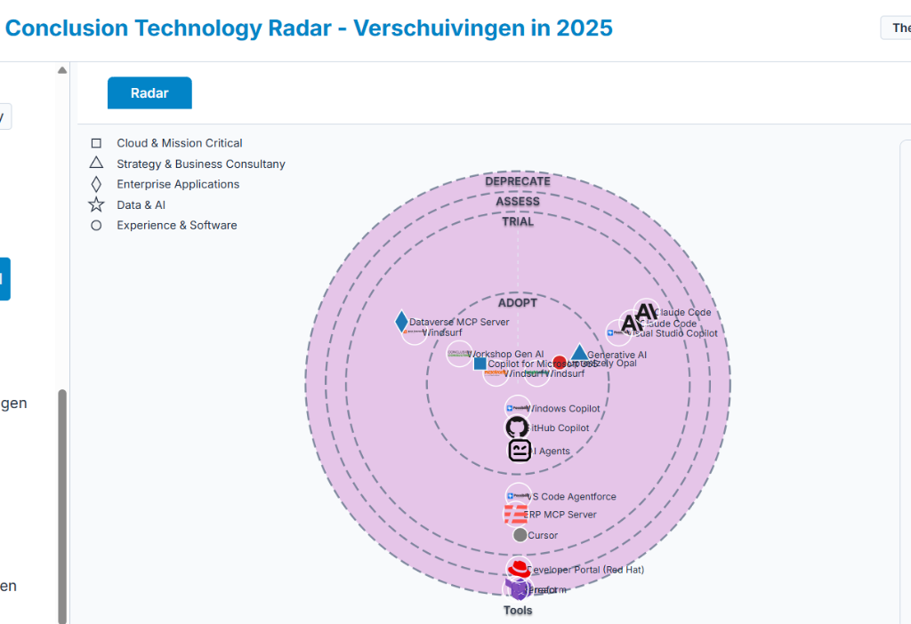
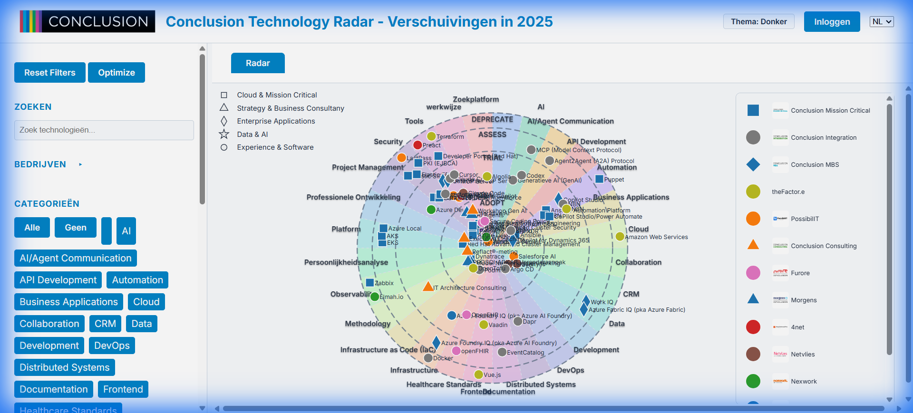

# Improved Blip Distribution

## Problem

The original blip distribution algorithm used a square-root approach for grid dimensions, which caused blips to cluster unnecessarily in the center of each ring sector, not utilizing the available space effectively.

## Before - Clustered Distribution



**Issues:**
- Blips heavily clustered in the center of each ring
- Poor utilization of available radial space
- Limited angular spread
- Wasted space in outer portions of rings

## After - Improved Distribution



**Improvements:**
- ✅ Blips spread more evenly across radial space
- ✅ Better angular distribution
- ✅ More natural, less grid-like appearance
- ✅ Better utilization of available space in each ring sector

## Changes Made

### Algorithm Improvements

**1. Radial Level Calculation**

Changed from square-root approach to a more intelligent calculation:

```javascript
// OLD: Square root approach (caused clustering)
const radialLevels = Math.ceil(Math.sqrt(count));

// NEW: Favor angular distribution
const radialLevels = Math.max(1, Math.min(
    Math.ceil(count / 4),        // At least 4 blips per radial level
    Math.ceil(ringWidth / 40)    // Or based on available radial space
));
```

**2. Reduced Margins**

```javascript
// OLD: Fixed margins
const radialSpace = outerR - innerR - 30;
const angularSpace = endAngle - startAngle - 0.15;

// NEW: Proportional margins
const radialMargin = Math.min(20, ringWidth * 0.15);
const radialSpace = ringWidth - radialMargin;
const angularMargin = Math.min(0.1, (endAngle - startAngle) * 0.1);
const angularSpace = endAngle - startAngle - angularMargin;
```

**3. Increased Jitter**

```javascript
// OLD: Small jitter
r += (Math.random() - 0.5) * Math.min(radialStep * 0.3, 8);
theta += (Math.random() - 0.5) * Math.min(angularStep * 0.3, 0.08);

// NEW: Increased jitter for more natural distribution
r += (Math.random() - 0.5) * Math.min(radialStep * 0.5, 15);
theta += (Math.random() - 0.5) * Math.min(angularStep * 0.4, 0.15);
```

**4. Smaller Boundary Margins**

```javascript
// OLD: 15px margins
r = Math.max(innerR + 15, Math.min(outerR - 15, r));

// NEW: 12px margins for better space utilization
const minR = innerR + 12;
const maxR = outerR - 12;
r = Math.max(minR, Math.min(maxR, r));
```

## Key Principles

1. **Favor Angular Distribution**: Use fewer radial levels and more angular divisions to spread blips horizontally across the ring
2. **Proportional Margins**: Scale margins based on available space rather than using fixed values
3. **Natural Randomness**: Increase jitter to avoid perfect grid patterns while maintaining good distribution
4. **Space Efficiency**: Reduce boundary margins to utilize more of the available ring space

## Files Modified

- [radar-layout.js](../js/radar/radar-layout.js) - Blip positioning algorithm
