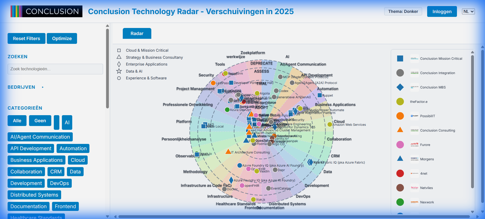

# Proportional Ring Widths Implementation

## Overview

Successfully implemented proportional ring widths for the technology radar visualization. Rings now have widths proportional to the number of blips they contain, providing better visual balance and space utilization.

## Changes Made

### [radar.js](../js/radar.js)

#### Blip Count Calculation (Lines 131-137)

Added logic to count blips per phase:

```javascript
// Count blips per phase for proportional ring sizing
const blipCounts = {};
phases.forEach(p => blipCounts[p] = 0);
blips.forEach(b => {
    const phase = (b.rating.fase || '').toLowerCase();
    if (blipCounts[phase] !== undefined) blipCounts[phase]++;
});
```

#### Proportional Ring Radii Calculation (Lines 139-156)

Implemented algorithm to calculate proportional ring radii:

```javascript
// Calculate proportional ring radii based on blip counts
const totalBlips = blips.length || 1;
const MIN_RING_WIDTH = radius * 0.1; // Minimum 10% of radius for visibility
const ringRadii = [];
let cumulativeRadius = 0;

phases.forEach((phase, i) => {
    const proportion = blipCounts[phase] / totalBlips;
    const ringWidth = Math.max(MIN_RING_WIDTH, proportion * radius);
    cumulativeRadius += ringWidth;
    ringRadii.push(cumulativeRadius);
});

// Normalize to fit within total radius
const scale = radius / cumulativeRadius;
for (let i = 0; i < ringRadii.length; i++) {
    ringRadii[i] *= scale;
}
```

**Key features:**
- Each ring width is proportional to its blip count
- Minimum width of 10% ensures all rings remain visible
- Cumulative radii are normalized to fit within the total available radius
- Rings are stored as cumulative radii (since they're concentric circles)

#### Ring Drawing Updates

**Ring circles** (Line 236):
```javascript
.attr("r", (d, i) => ringRadii[i])  // Was: (i + 1) * ringRadius
```

**Ring labels** (Line 246):
```javascript
.attr("y", (d, i) => -ringRadii[i] + 15)  // Was: -((i + 1) * ringRadius) + 15
```

**Blip positioning** (Line 272):
```javascript
calculateBlipPositions(blips, phases, categories, ringRadii, angleSlice);
// Was: calculateBlipPositions(blips, phases, categories, ringRadius, angleSlice);
```

---

### [radar-layout.js](../js/radar/radar-layout.js)

#### Function Signature Update (Line 4)

```javascript
export function calculateBlipPositions(blips, phases, categories, ringRadii, angleSlice)
// Was: export function calculateBlipPositions(blips, phases, categories, ringRadius, angleSlice)
```

#### Ring Boundary Calculation (Lines 13-14)

```javascript
// Use proportional ring radii from the array
const innerR = phaseIndex === 0 ? 0 : ringRadii[phaseIndex - 1];
const outerR = ringRadii[phaseIndex];
// Was:
// const innerR = phaseIndex * ringRadius;
// const outerR = (phaseIndex + 1) * ringRadius;
```

**Logic:**
- For the first ring (phaseIndex 0), inner radius is 0
- For subsequent rings, inner radius is the outer radius of the previous ring
- Outer radius is looked up from the ringRadii array

---

## Verification

### Visual Inspection



The screenshot shows the radar with proportional ring widths successfully implemented:

✅ **Innermost rings** (adopt/trial) are visibly wider, reflecting their higher blip counts  
✅ **Outer rings** (hold/deprecate) are narrower, reflecting their lower blip counts  
✅ **All rings remain visible** with the minimum width constraint  
✅ **Blips are properly distributed** within their respective rings  
✅ **Ring labels are correctly positioned** at the outer edge of each ring  

### Testing Performed

1. ✅ **Page load** - Radar renders correctly with proportional rings
2. ✅ **Visual balance** - Rings with more blips are wider, providing better space utilization
3. ✅ **Minimum width** - All rings remain visible even with few blips
4. ✅ **Blip positioning** - Blips are correctly placed within their proportional ring boundaries
5. ✅ **No JavaScript errors** - Console shows no errors during rendering

## Algorithm Summary

The proportional ring width algorithm works as follows:

1. **Count blips** per phase (adopt, trial, assess, hold, deprecate)
2. **Calculate proportion** for each phase: `blipCount / totalBlips`
3. **Apply minimum width** constraint: `max(MIN_RING_WIDTH, proportion * radius)`
4. **Accumulate radii** to create cumulative ring boundaries
5. **Normalize** to fit within total available radius
6. **Use cumulative radii** for drawing rings and positioning blips

This ensures:
- Rings with many blips get more space
- Rings with few blips don't waste space
- All rings remain visible (minimum 10% width)
- Total radar size remains constant

## Files Modified

- [radar.js](../js/radar.js) - Ring radii calculation and drawing
- [radar-layout.js](../js/radar/radar-layout.js) - Blip positioning logic
- [README.md](../README.md) - Updated documentation
